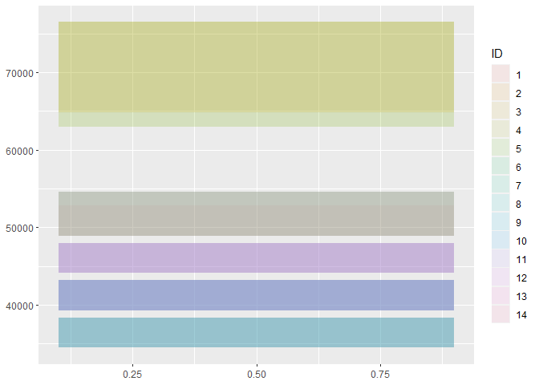
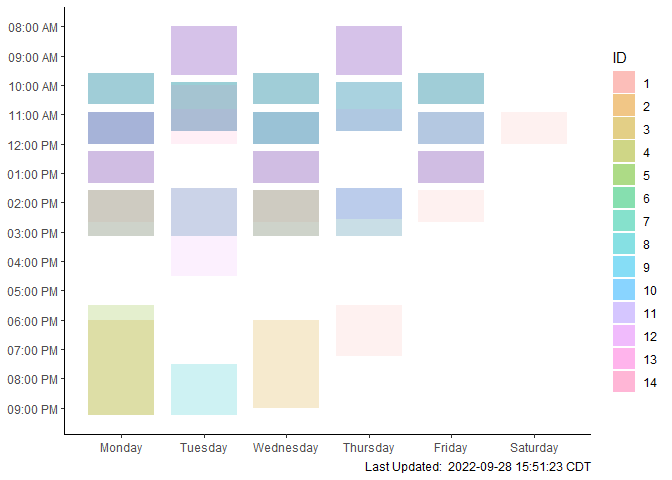

Overlapping Schedule Maker
================
28 September, 2022

# What is This For???

This provides a function and a sub-function that converts weekly
schedule data into a plot of overlapping time-boxes, in order to answer
questions like “when does a group of people have availability?” or “Who
is busy at a given time?”

It was initially conceived of in the context of higher ed student
schedules, but could be used for group schedules in any other context,
or room/resource schedules as well (although hopefully with fewer
overlaps in those cases). Since the plotting is done by a function, this
code can easily be used to generate multiple outputs for different
groups or resources within an organization.

## Input Data

This is designed to work with a dataset, which has one row per scheduled
event, and the below columns:

-   ID: identifies the people/groups/entities to whom the schedules
    belong
-   BEGIN_TIME: formatted as HHMM in military time
-   END_TIME: formatted as HHMM in military time
-   MONDAY_IND: equal to “M” if the event occurs on Mondays, else null
-   TUESDAY_IND: equal to “T” if the event occurs on Tuesdays, else null
    (not saying this is the ideal format, but it’s the one I was given)
-   WEDNESDAY: equal to “W” if the event occurs on Wednesdays, else null
-   THURSDAY_IND: equal to “R” if the event occurs on Thursdays, else
    null
-   FRIDAY_IND: equal to “F” if the event occurs on Fridays, else null
    (see above)
-   SATURDAY_IND: equal to “S” if the event occurs on Saturday, else
    null
-   SUNDAY_IND: equal to “U” if the event occurs on Sunday, else null

But it could just as easily be converted from any weekly schedule-type
data that isn’t in a work management/email/meeting application already.

This will plot the schedules accurately whether someone enters a daily
activity on 5/7 separate line items, or enters it on one line with each
indicator populated.

## Functions

**Sub-function:** DayPlotter is a sub function that takes timed events
that would be on the same day (SliceDF) and creates a series of
geom_rects (with position controlled by xcent). This output of this
function will be unformatted, unflipped, etc. and have numeric time
value.

Example:

``` r
ggplot() + Schedule %>% filter(MONDAY_IND == "M") %>% DayPlotter(.5)
```

<!-- -->

**Main function:** SchedulePlotter takes a dataframe of the format
specified at the top of this doc, creates daily plots using the
sub-fucntion DayPlotter, and then combines / formats them into a weekly
schedule.

Example:

``` r
Schedule %>% SchedulePlotter()
```

<!-- -->

Please note the ability to color as needed by individual/group/etc. for
added information OR to use a single color if that information is not
relevant.
